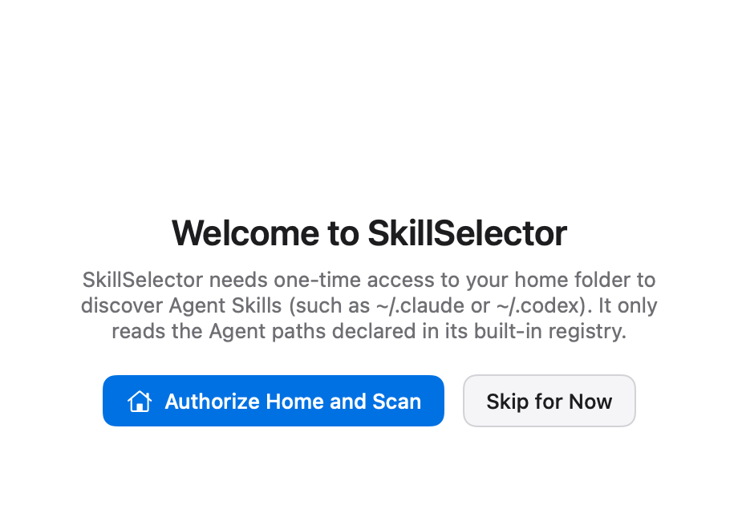
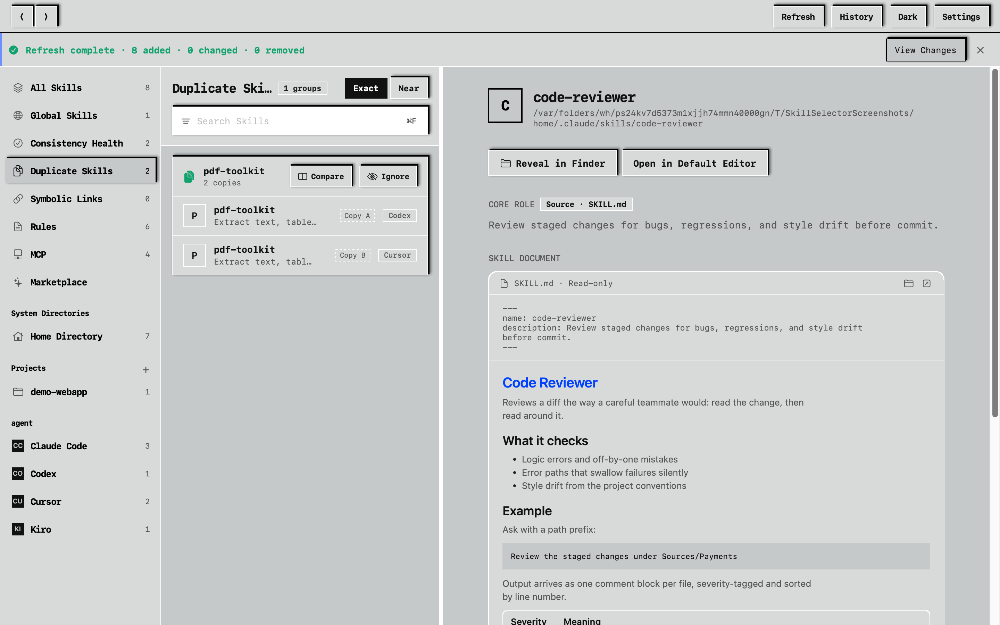
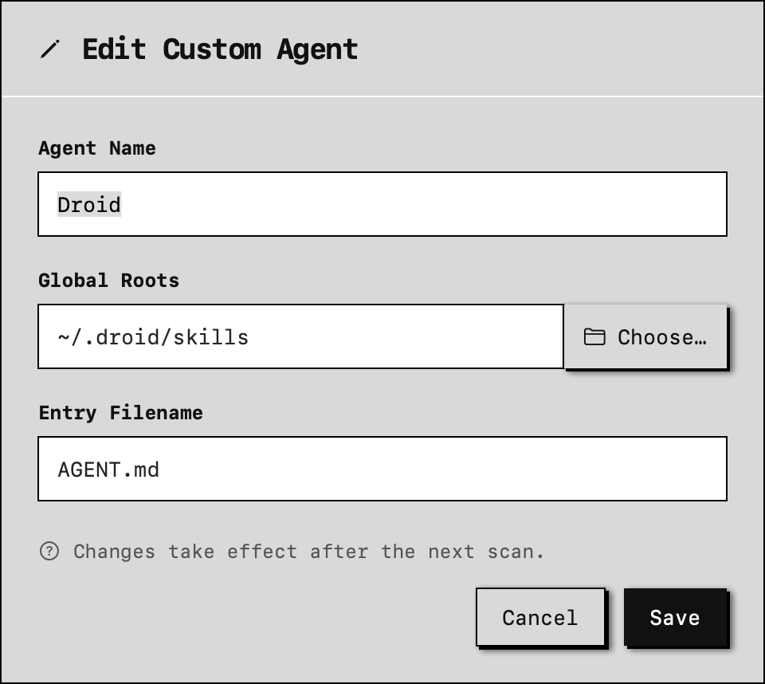
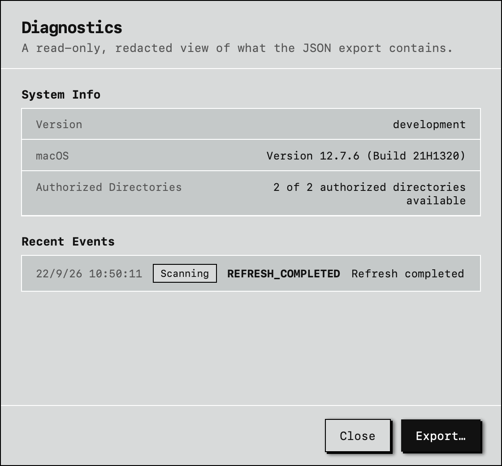

[](README.en.md)
[](README.md)

# SkillSelector

A native macOS app for managing Agent Skills on your machine: browse, search, copy, move, delete, link. That's all it does — it is not a marketplace, not an installer, and there is no AI in it.


## What it does

The main window is a three-column browser: a sidebar grouped by scope and Agent, a searchable, sortable list of Skills, and a detail pane showing the selected Skill's description, frontmatter, rendered Markdown document, associated Agents, and install locations. In search, a plain term matches the name, description, and path at once; prefix it with `name:`, `desc:`, `path:`, or `agent:` to search one field only — for example `agent:cursor path:.agents`.

The file operations are the everyday ones: copy, move (to any folder you pick), symbolic links, and delete. Deletion only ever moves things to the Trash — there is no permanent-delete path anywhere in the app. The list supports ⌘-click and Shift-range selection, and a multi-selection can be copied, moved, or deleted in one summarized confirmation.

Also:

- On first launch the app walks you through granting home-directory access (a sandboxed app can't get it silently), then scans automatically on later launches; you can add just project folders instead
- The sidebar's "Duplicate Skills" groups content-identical copies scattered across Agents by content fingerprint, which makes tidying up straightforward; directories whose authorization broke land in "Needs re-authorization" with a one-click fix
- Sidebar directories have a right-click Remove; the custom Agent editor includes a project-pattern dry run that previews which directories a pattern will hit before you save
- Importing a folder scans that folder only — the Skill list appears right away instead of after a wait
- Custom Agents export to JSON and import on another machine
- The diagnostics report can be viewed in-app (redacted exactly like the export) or exported as JSON
- SKILL.md files stay read-only — reveal in Finder or open in your default editor
- Light/dark toggle in the title bar, or follow the system
- English and Simplified Chinese, following the system language










## Supported Agents

Nineteen built in: Claude Code, Codex, Qoder, CodeBuddy, OpenCode, Cursor, Kilo Code, Cline, Roo Code, Windsurf, Gemini CLI, GitHub Copilot, Amp, Tabnine, Letta, OpenHands, Goose, Kiro, Factory Droid.

Roo Code is legacy compatibility and only appears once detected or enabled in Settings. Any local Skill directory can be registered as a custom Agent.

## Privacy

Runs offline. No telemetry, no crash reporter, no file watcher, no bundled model. The index stores metadata only (paths, owning Agents, descriptions) and never copies Skill content; folder access goes through security-scoped bookmarks, and scans stick to the fixed paths declared in the registry.

## Install

Requires macOS 14 Sonoma or later; Universal 2 (Apple Silicon and Intel).

1. Download the `.dmg` and its `.sha256` from [GitHub Releases](https://github.com/BlackArt40/SkillSelector/releases)
2. Verify integrity (keep both files in the same directory):

   ```zsh
   shasum -a 256 -c SkillSelector-1.3.4.dmg.sha256
   ```

   It must print `SkillSelector-1.3.4.dmg: OK`. If it doesn't, don't install it.

3. Mount the `.dmg` and drag `SkillSelector.app` to Applications
4. Right-click the app → Open → confirm Open

Gatekeeper blocks un-notarized apps on first launch; that's expected. If the right-click menu has no Open entry, go to System Settings → Privacy & Security and click Open Anyway next to SkillSelector.

## About the signature

Releases are ad-hoc signed (`codesign --sign -`): no Apple Developer certificate, no notarization. What that means in practice:

- App Sandbox is on; the requested entitlements are listed in [`Packaging/SkillSelector.entitlements`](Packaging/SkillSelector.entitlements)
- The signature detects tampering with the app bundle after signing
- It proves nothing about the publisher — anyone can produce an ad-hoc signature. Download only from this repository's Releases and check the `.sha256`
- Gatekeeper will block the first launch; allow it manually as described above

If that's not acceptable, build from source — it goes through the same packaging script.

## Building from source

```zsh
swift build
zsh Scripts/package-dmg.sh 1.3.4
```

Produces `dist/SkillSelector.app`, `dist/SkillSelector.dmg`, `dist/SkillSelector-1.3.4.dmg`, and a matching `.sha256`.

The only third-party dependency is Yams (frontmatter parsing). Run the tests with `swift test`; CI runs them on every PR and push.

## Versioning

`MAJOR.MINOR.PATCH`: small changes bump PATCH (1.0.1 → 1.0.2), substantive features bump MINOR (1.1.0), a redesign bumps MAJOR (2.0.0).

## License

Apache 2.0. See [LICENSE](LICENSE).
