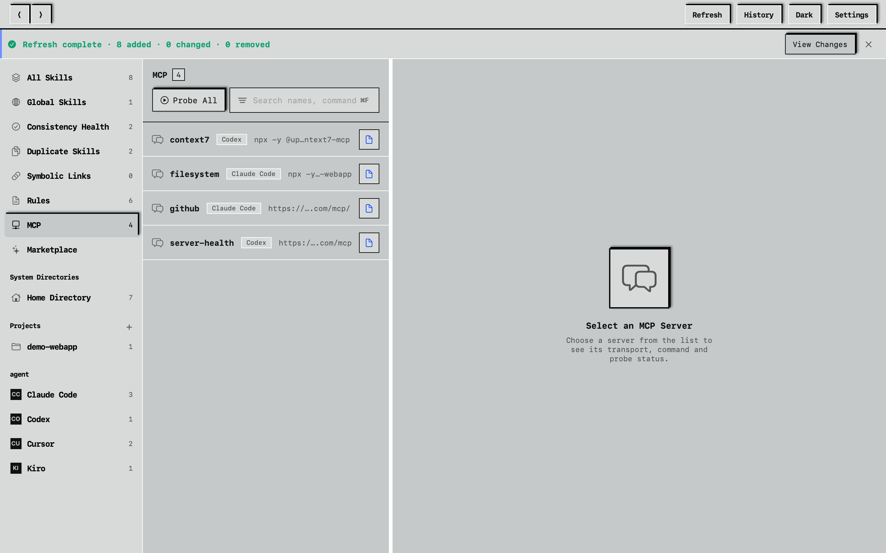
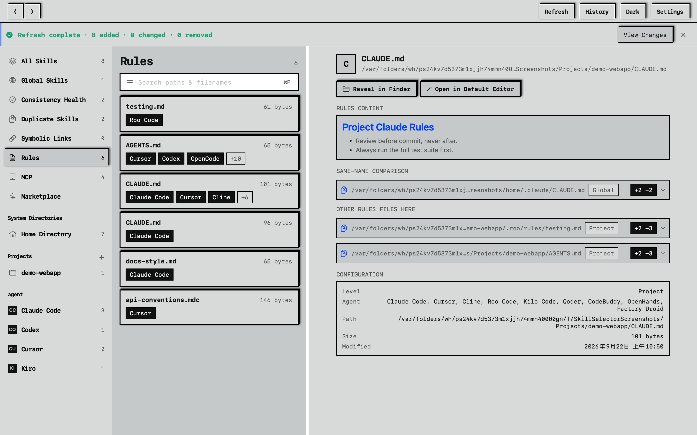
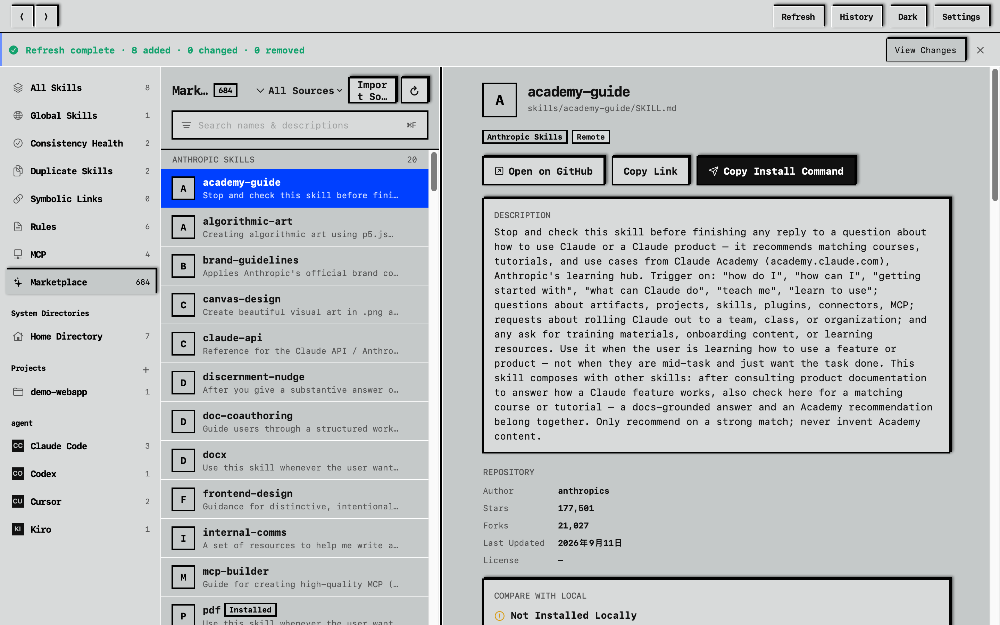

[](README.en.md)
[](README.md)

# SkillSelector

A native macOS app for managing Agent Skills on your machine: browse, search, review duplicates and symbolic links. It is a read-only dashboard — not a marketplace, not an installer, and there is no AI in it; file operations belong to Finder.


## What it does

The main window is a three-column browser: a sidebar grouped by scope and Agent, a searchable, sortable list of Skills, and a detail pane showing the selected Skill's description, frontmatter, rendered Markdown document, associated Agents, and install locations. In search, a plain term matches the Skill name, description, or indexed body; prefix it with `name:`, `desc:`, `path:`, or `agent:` to search one field only — for example `agent:cursor path:.agents`. Back/forward (⌘[ / ⌘]) sit in the title bar and in the menu bar's Go menu; ⌘F focuses the search field; sidebar switches, detail openings and each search session record one history step. The middle column's right edge is draggable to resize it, and the app is single-window (no "New Window" menu item).

Also:

- Authorization is never forced: the app opens to an empty state you can browse, and a prominent button starts the scan; later launches auto-scan, or you can add just project folders
- The sidebar's "Duplicate Skills" groups content-identical copies by body-only fingerprint (SKILL.md, ignoring frontmatter) — mark a whole group ignored and the choice survives restarts; directories whose authorization broke land in a top banner and "Needs re-authorization" with a one-click fix
- The sidebar's "Symbolic Links" lists every link installation (source → target) and highlights broken targets
- The sidebar's "MCP" detects MCP servers declared in each Agent's config (Codex TOML, Cursor/Claude JSON, project `.mcp.json`); "Probe" runs the real MCP initialize handshake — stdio servers are launched, judged, then reaped, http/sse get an initialize request. Read-only, on demand, never resident
- The sidebar's "Rules" lists each Agent's instruction files (`CLAUDE.md`, `AGENTS.md`, `.cursorrules`, plus directory sources like `.cursor/rules`, `.claude/rules`, `.roo/rules` and the GEMINI.md hierarchy) with rendered Markdown details; equally read-only
- Beyond exact duplicates there's **near-duplicate** grouping (MinHash similarity fingerprints) and a **compare sheet**: view two copies' frontmatter, body and child files side by side
- Refresh history (what was added / changed / removed) is kept locally and always reviewable
- The sidebar's "Marketplace" fetches 7 verified GitHub repos on demand (Anthropic official plus community collections like Superpowers and Vercel — about 680 skills), browses them grouped by repository with a source filter, and shows each skill's description and document; "Import Source" adds your own repo (owner/repo or link). Browsing only: open on GitHub, copy the link, or copy the `npx skills add …` install command — installation stays with the ecosystem's tooling
- Project / system-directory entries appear only when they hold Skills; "All Skills", "Global Skills", "Duplicates", "Symbolic Links" and "Agents" are always visible
- Agent rows in the sidebar show the matching brand mark (Claude Code, Codex, Cursor, …) or a letter monogram when no mark ships
- Importing a folder scans that folder only — the Skill list appears right away instead of after a wait; the Duplicates, MCP, Rules and Symbolic Links pages each have their own in-column search bar
- The diagnostics report can be viewed in-app (redacted exactly like the export) or exported as JSON
- SKILL.md files stay read-only — reveal in Finder or open in your default editor; the app performs no copy, move, delete, or link operations
- Light/dark toggle in the title bar, or follow the system
- English and Simplified Chinese, following the system language









## Supported Agents

Nineteen built in: Claude Code, Codex, Qoder, CodeBuddy, OpenCode, Cursor, Kilo Code, Cline, Roo Code, Windsurf, Gemini CLI, GitHub Copilot, Amp, Tabnine, Letta, OpenHands, Goose, Kiro, Factory Droid.

Roo Code is legacy compatibility and only appears once detected or enabled in Settings. Any local Skill directory can be registered as a custom Agent.

## Privacy

The local features run offline. No telemetry, no crash reporter, no file watcher, no bundled model. The only outbound traffic is the Marketplace fetching its declared GitHub sources on demand (a request happens only when you open that section or hit refresh — never polled, never persisted). The index stores metadata only (paths, owning Agents, descriptions) and never copies Skill content; folder access goes through security-scoped bookmarks, and scans stick to the fixed paths declared in the registry.

## Install

Requires macOS 15 Sequoia or later; Universal 2 (Apple Silicon and Intel).

1. Download the `.dmg` and its `.sha256` from [GitHub Releases](https://github.com/BlackArt40/SkillSelector/releases)
2. Verify integrity (keep both files in the same directory):

   ```zsh
   shasum -a 256 -c SkillSelector-1.8.0.dmg.sha256
   ```

   It must print `SkillSelector-1.8.0.dmg: OK`. If it doesn't, don't install it.

3. Mount the `.dmg` and drag `SkillSelector.app` to Applications
4. Right-click the app → Open → confirm Open

Gatekeeper blocks un-notarized apps on first launch; that's expected. If the right-click menu has no Open entry, go to System Settings → Privacy & Security and click Open Anyway next to SkillSelector.

## About the signature

Releases are ad-hoc signed (`codesign --sign -`): no Apple Developer certificate, no notarization. What that means in practice:

- App Sandbox is on; the requested entitlements are listed in [`Packaging/SkillSelector.entitlements`](Packaging/SkillSelector.entitlements)
- The signature detects tampering with the app bundle after signing
- It proves nothing about the publisher — anyone can produce an ad-hoc signature. Download only from this repository's Releases and check the `.sha256`
- Gatekeeper will block the first launch; allow it manually as described above

If that's not acceptable, build from source — it goes through the same packaging script.

## Building from source

```zsh
swift build
zsh Scripts/package-dmg.sh 1.8.0
```

Produces `dist/SkillSelector.app`, `dist/SkillSelector.dmg`, `dist/SkillSelector-1.8.0.dmg`, and a matching `.sha256`.

The only third-party dependency is Yams (frontmatter parsing). Run the tests with `swift test`; CI runs them on every PR and push.

## Versioning

`MAJOR.MINOR.PATCH`: small changes bump PATCH (1.0.1 → 1.0.2), substantive features bump MINOR (1.1.0), a redesign bumps MAJOR (2.0.0).

## License

Apache 2.0. See [LICENSE](LICENSE).
