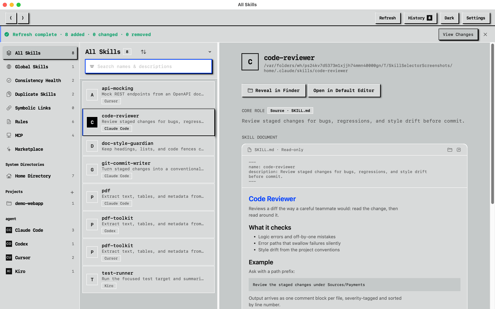
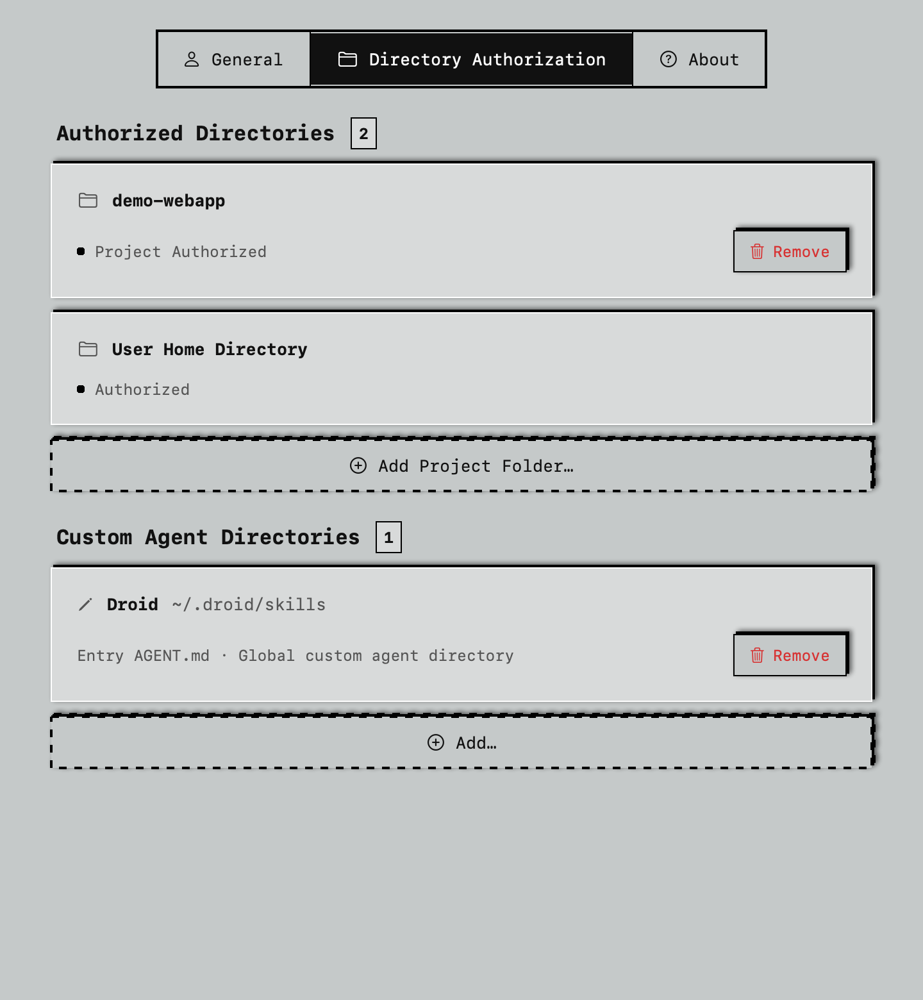

[](README.en.md)
[](README.md)

# SkillSelector

A native macOS app for managing Agent Skills on your local machine. Browse, search, copy, move, delete, and link Skills. Not a marketplace, not an installer, not an AI tool.

## Features

- **Three-column browser**: sidebar grouped by scope and Agent (All / Global / Directories / Agents), a searchable and sortable Skill list, and a detail pane with description, frontmatter, rendered Markdown, associated Agents, and locations
- **Search & sort**: match by name, description, or path; sort by default order, name, or path
- **File operations**: copy, move, create symbolic link, move to Trash. Copy and move can target **any folder you pick** (granted via the folder picker); link and delete stay within authorized Skill roots. Deletion always goes to Trash — never permanent
- **Skill documents**: rendered with the system Markdown parser (headings, lists, code blocks, link whitelist); frontmatter parsed with Yams, so nested YAML no longer misreports
- **Dark mode**: one-click light/dark toggle in the title bar, or follow the system
- **Directory authorization**: authorize the home directory or add project folders via security-scoped bookmarks; scans only whitelisted fixed paths
- **Custom Agents**: register any local Skill directory as a custom Agent

## Supported Agents

Claude Code, Codex, Qoder, CodeBuddy, OpenCode, Cursor, Kilo Code, Cline, Roo Code, Windsurf, Gemini CLI, GitHub Copilot, Amp, Tabnine, Letta, and OpenHands. Roo Code works but only shows when detected or manually enabled. You can define custom Agents pointing to any local Skill directory.

## Privacy

Runs offline. Stores index metadata (path, owning Agents, scope, description, source) and security-scoped bookmarks — **never copies Skill content**. No telemetry, no crash reporter, no bundled model, no file watcher. SKILL.md stays read-only; it is only revealed in Finder or opened in your default editor.

## Screenshots





## Requirements

- macOS 14 Sonoma or later
- Universal 2 build (Apple Silicon + Intel)
- English and Simplified Chinese

## Build

```zsh
swift build
zsh Scripts/package-dmg.sh 1.0.1
```

Produces `dist/SkillSelector.app`, `dist/SkillSelector.dmg`, `dist/SkillSelector-1.0.1.dmg`, and a matching `.sha256` for GitHub Releases.

## Installation

1. Download the `.dmg` and its `.sha256` from [GitHub Releases](https://github.com/BlackArt40/SkillSelector/releases)
2. Verify integrity (keep both files in the same directory):

   ```zsh
   shasum -a 256 -c SkillSelector-1.0.1.dmg.sha256
   ```

   It must print `SkillSelector-1.0.1.dmg: OK`. If it doesn't, don't install it.

3. Mount the `.dmg` and drag `SkillSelector.app` to Applications
4. Right-click the app → **Open** → confirm **Open**

macOS Gatekeeper blocks un-notarized apps by default. If the right-click menu doesn't show **Open**, go to System Settings → Privacy & Security → click **Open Anyway** next to the SkillSelector entry.

## Code signing

Releases are **ad-hoc signed** (`codesign --sign -`): **no Apple Developer certificate, no notarization**. Be clear on what that does and does not buy you:

- ✅ App Sandbox is enabled; the requested entitlements are in [`Packaging/SkillSelector.entitlements`](Packaging/SkillSelector.entitlements)
- ✅ The signature detects tampering with the app bundle after signing
- ❌ **It proves nothing about who published it** — anyone can produce an ad-hoc signature. Download only from this repository's GitHub Releases and check the `.sha256`
- ❌ Not notarized, so Gatekeeper blocks the first launch and you must allow it manually per step 4

If that's not acceptable, build from source (see **Build**) — releases go through the same packaging script.

## Versioning

Versions follow `MAJOR.MINOR.PATCH`. Non-major changes bump only PATCH (1.0.1 → 1.0.2); substantive feature changes bump MINOR (1.1.0); a major redesign bumps MAJOR (2.0.0).

## License

Apache 2.0. See [LICENSE](LICENSE).
