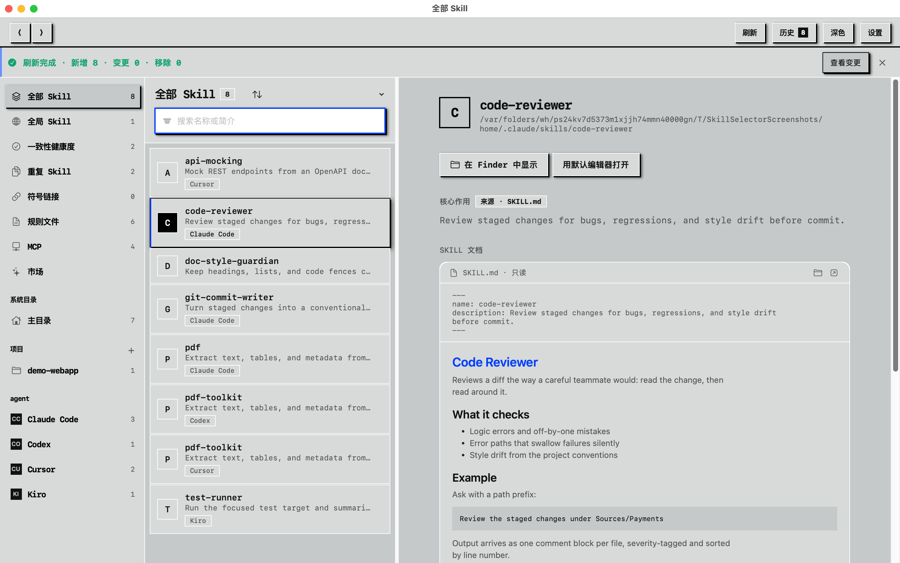
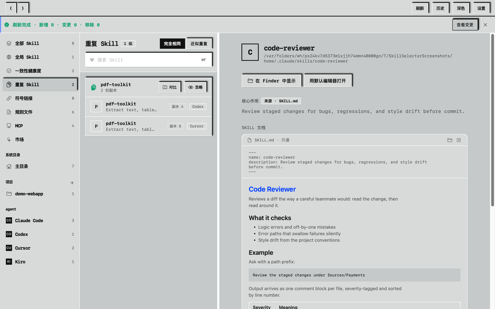
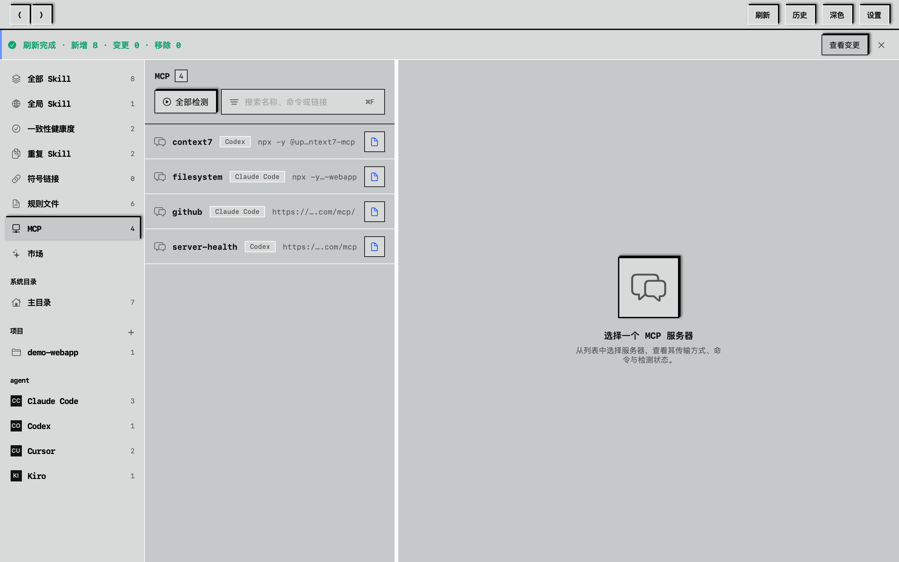
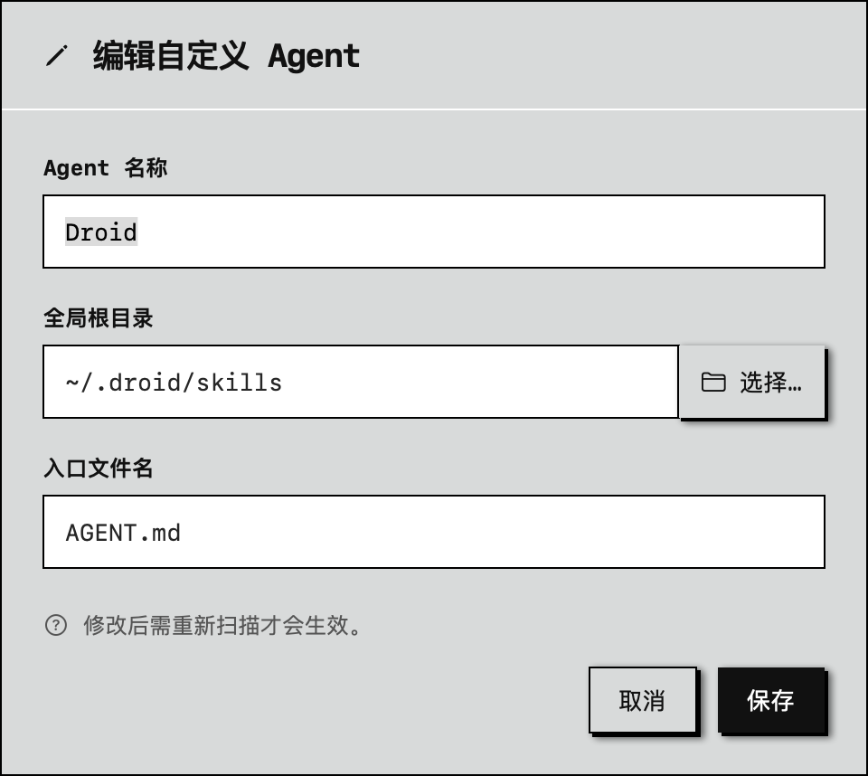
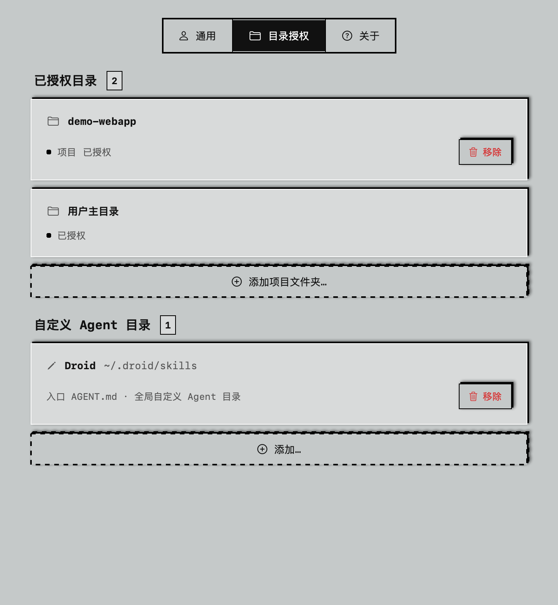
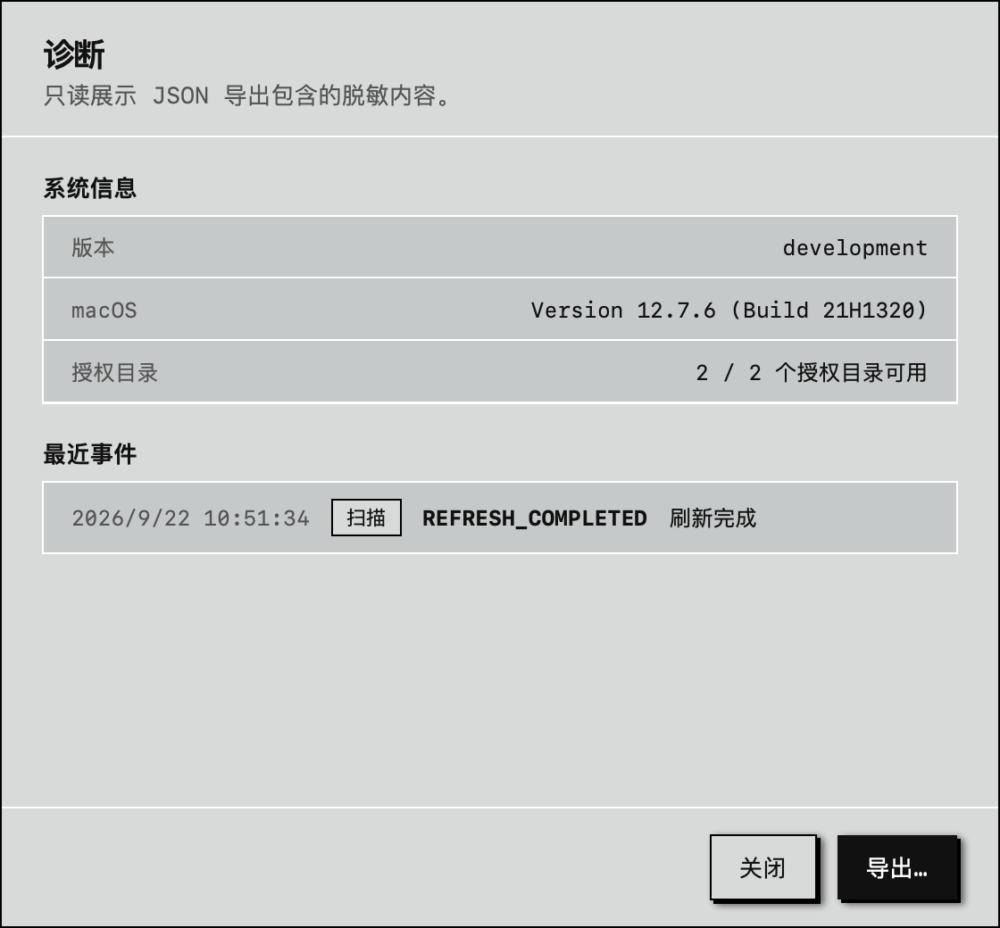
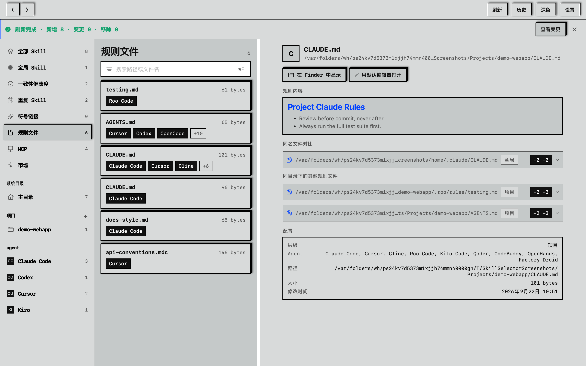
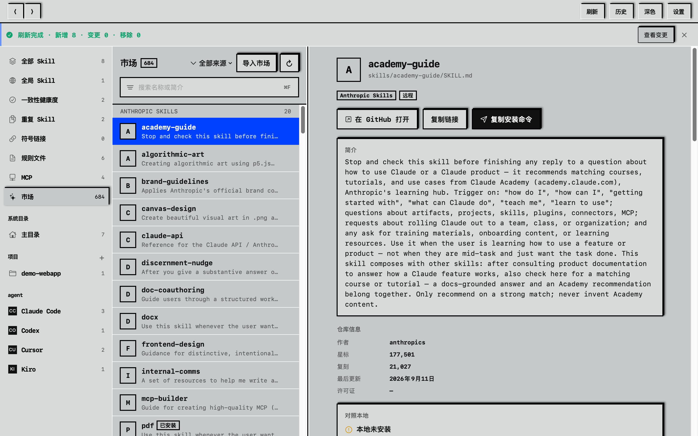

[](README.en.md)
[](README.md)

# SkillSelector

macOS 原生应用，管理本机的 Agent Skill：浏览、搜索、查看重复与符号链接，也可只读浏览 Skill 市场。它是一个只读的信息看板——不是安装器，里面也没有 AI；文件操作交给 Finder。



## 它能做什么

主界面是三栏浏览器：侧边栏按范围和 Agent 分组，中间是可搜索、可排序的 Skill 列表，右侧显示选中 Skill 的详情——简介、frontmatter、渲染后的 Markdown 文档、关联的 Agents 和安装位置。搜索时普通词匹配 Skill 名称、简介或已索引正文；给词加上 `name:`、`desc:`、`path:`、`agent:` 前缀就只搜对应字段，比如 `agent:cursor path:.agents`。右上角有前进 / 后退（⌘[ / ⌘]），菜单栏「前往」也有同样的前进 / 后退，按 ⌘F 聚焦搜索框；侧边栏切换、打开详情、搜索各记一步历史。中列右缘可以拖拽调整宽度，应用是单窗口（菜单里没有"新建窗口"）。

另外：

- 不强制授权：首次启动可以直接浏览空状态，点授权按钮再开始扫描；之后启动自动扫描，也可以只添加项目文件夹
- 侧边栏的「重复 Skill」按内容指纹（仅 SKILL.md 正文）把散落各 Agent 的相同副本分组，可以整组标记「已忽略」，重启后保持；授权失效的目录会出现在顶部横幅和「需要重新授权」，点一下就能重新授权
- 侧边栏的「符号链接」列出所有软链接安装（源 → 目标），目标失效时高亮警告
- 侧边栏的「MCP」检测 Agent 配置里的 MCP 服务器（Codex TOML、Cursor/Claude 等的 JSON、项目 `.mcp.json`）；点「检测」会执行真实的 MCP initialize 握手——stdio 服务器启动后判活再回收，http/sse 发初始化请求，只读、按需触发、不常驻
- 侧边栏的「规则文件」列出 Agent 的指示文件（`CLAUDE.md`、`AGENTS.md`、`.cursorrules`，含 `.cursor/rules`、`.claude/rules`、`.roo/rules` 等目录源与 GEMINI.md 层级），详情渲染 Markdown；同样只读
- 重复分组之上还有**近似重复**（MinHash 相似度指纹）与**副本对比**：并排查看两个副本的 frontmatter、正文与子文件差异
- 「刷新」的变更历史（新增 / 修改 / 移除了哪些）保留在本地，随时可回看
- 侧边栏的「市场」按需抓取 7 个核实过的 GitHub 仓库（Anthropic 官方与 Superpowers、Vercel 等社区集合，约 680 个 Skill），按仓库分组浏览、可按来源筛选，每个 Skill 带简介与文档；「导入市场」可添加自定义仓库（owner/repo 或链接）。仅只读浏览：在 GitHub 打开、复制链接或复制 `npx skills add …` 安装命令，安装交给生态 CLI 与 Finder
- 项目 / 系统目录入口在有数据时才显示；「全部 Skill」「全局 Skill」「重复」「符号链接」「Agents」始终可见
- 侧边栏的 Agent 行显示对应品牌图标（Claude Code、Codex、Cursor 等），没有图标的显示首字母徽章
- 导入新目录只扫描该目录，Skill 列表立即出现，不卡在等待里；重复 Skill、MCP、规则文件、符号链接页的列表也各有列内搜索栏
- 诊断报告可以在应用内直接查看（与导出同样的脱敏），也可以导出 JSON
- SKILL.md 只读：在 Finder 里显示，或用默认编辑器打开；应用内不做复制、移动、删除或创建链接
- 标题栏可切换亮色 / 深色，或跟随系统
- 界面为英文和简体中文，跟随系统语言















## 支持的 Agent

内置 19 个：Claude Code、Codex、Qoder、CodeBuddy、OpenCode、Cursor、Kilo Code、Cline、Roo Code、Windsurf、Gemini CLI、GitHub Copilot、Amp、Tabnine、Letta、OpenHands、Goose、Kiro、Factory Droid。

Roo Code 属于旧版兼容，只在检测到已有 Skill 或在设置里手动启用时才显示。任何本地 Skill 目录都可以登记为自定义 Agent。

## 隐私

本机功能离线运行。没有遥测、崩溃报告、文件监视器，也不捆绑模型；唯一的外联是「市场」按需抓取声明的 GitHub 来源（仅在打开该区或点刷新时请求，不轮询、不落盘）。索引只存元数据（路径、归属 Agent、简介等），不复制 Skill 内容；目录访问走安全作用域书签，扫描范围限于注册表声明的固定路径。

## 安装

需要 macOS 15 Sequoia 或更高，Universal 2（Apple Silicon 和 Intel）。

1. 从 [GitHub Releases](https://github.com/BlackArt40/SkillSelector/releases) 下载 `.dmg` 和同名的 `.sha256`
2. 校验完整性（两个文件放同一目录）：

   ```zsh
   shasum -a 256 -c SkillSelector-1.7.1.dmg.sha256
   ```

   输出必须是 `SkillSelector-1.7.1.dmg: OK`。不是就别装。

3. 挂载 `.dmg`，把 `SkillSelector.app` 拖进 Applications
4. 右键点击应用 → 打开 → 确认打开

Gatekeeper 会拦截未公证的应用，这是预期行为。如果右键菜单里没有「打开」，前往系统设置 → 隐私与安全性，点 SkillSelector 旁边的「仍然打开」。

## 关于签名

发布版是 ad-hoc 签名（`codesign --sign -`）：没有 Apple 开发者证书，也没有公证。实际含义：

- App Sandbox 已启用，声明的权限都在 [`Packaging/SkillSelector.entitlements`](Packaging/SkillSelector.entitlements) 里
- 签名可以发现应用包在签名之后被改动
- 它证明不了发布者——任何人都能生成 ad-hoc 签名。只从本仓库的 Releases 下载，并核对 `.sha256`
- Gatekeeper 首次启动会拦截，需要按上面的步骤手动放行

不放心就从源码自建，走的是同一条打包脚本。

## 从源码构建

```zsh
swift build
zsh Scripts/package-dmg.sh 1.7.1
```

产物：`dist/SkillSelector.app`、`dist/SkillSelector.dmg`、`dist/SkillSelector-1.7.1.dmg` 和对应的 `.sha256`。

第三方依赖只有 Yams（frontmatter 解析）。测试用 `swift test`，CI 在每个 PR 和 push 上都会跑。

## 版本

`MAJOR.MINOR.PATCH`：小改动升 PATCH（1.0.1 → 1.0.2），实质性功能升 MINOR（1.1.0），重设计升 MAJOR（2.0.0）。

## 许可证

Apache 2.0，见 [LICENSE](LICENSE)。
